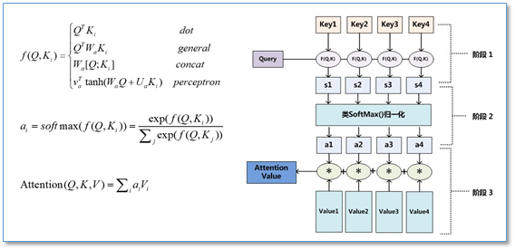

# CS224n
Notes and Codes for Stanford Open Course: DL in NLP

First half of the notes are written with *OneNote* and the others are written in *Latex*.

Course Video: https://www.youtube.com/watch?v=OQQ-W_63UgQ&list=PL3FW7Lu3i5Jsnh1rnUwq_TcylNr7EkRe6

Official website: http://web.stanford.edu/class/cs224n/archive/WWW_1617/syllabus.html

**NLP**
- Syntax
  - Word2Vec
    - CBOW
    - Skip-Gram
    - Glove
  - POS tag
  - Parsing
    - Dependency Parsing (Shift-Reduce)
    - Constituency Parsing (CFG)
  - Word Segmentation (Jieba-Cut)
- Semantics
  - Machine Translation
  - Named Entity Recognation
  - Named Entity Linking
  - Question Answering
  - Relation Extraction
  - Word sense disambiguation (WordNet)
- Discourse
  - Automatic summarization
  - Coreference Resolution
- Speech

**Attention Architecture**  

**Projective Dependency Parsing**

The tree in Figure 1 is projective, meaning that if we put the words in their linear order, preceded by the root, the edges can be drawn above the words without crossings, or, equivalently, a word and its descendants form a contiguous substring of the sentence.
